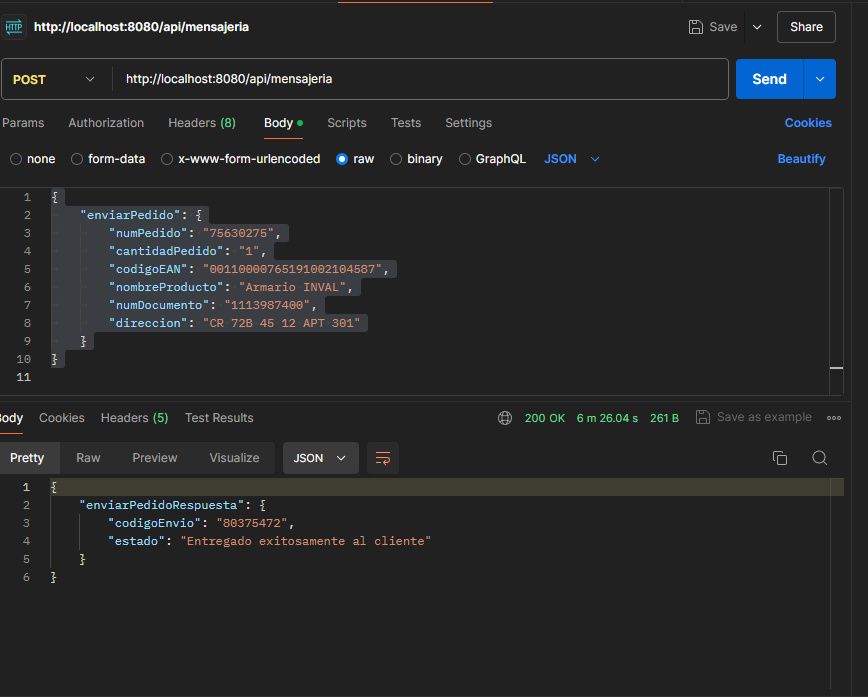
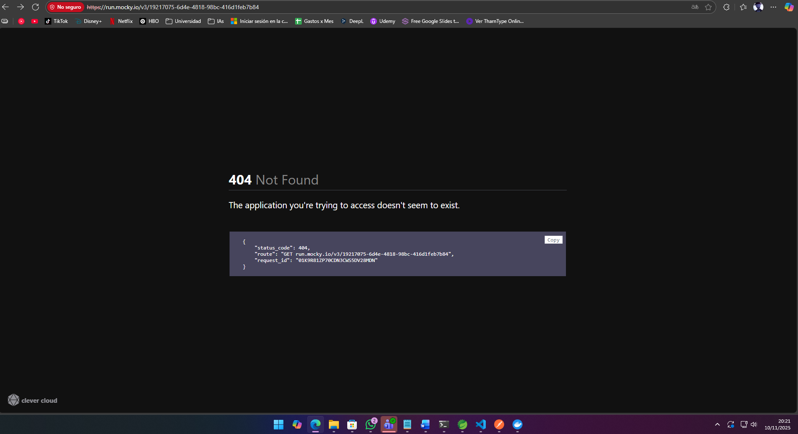

# A.	Se debe exponer una API REST con mensajería json.

Respuesta: Se realiza exposición de api REST en el puerto 8080 con los criterios solicitados, se adjunta imagen de consumo en postman: 

# B.	Realizar transformación de la petición de json a xml, teniendo en cuenta la siguiente tabla de mapeo:

Respuesta:
Json de entrada: 
{
	"enviarPedido": {
		"numPedido": "75630275",
		"cantidadPedido": "1",
		"codigoEAN": "00110000765191002104587",
		"nombreProducto": "Armario INVAL",
		"numDocumento": "1113987400",
		"direccion": "CR 72B 45 12 APT 301"
	}
}

XML transformado: Se imprime en consola el xml transformado
<EnvioPedidoAcme><EnvioPedidoRequest><pedido>75630275</pedido><Cantidad>1</Cantidad><EAN>00110000765191002104587</EAN><Producto>Armario INVAL</Producto><Cedula>1113987400</Cedula><Direccion>CR 72B 45 12 APT 301</Direccion></EnvioPedidoRequest></EnvioPedidoAcme>

Endpoint: https://run.mocky.io/v3/19217075-6d4e-4818-98bc-416d1feb7b84  

# C.	Realizar transformación de la respuesta de xml a json, teniendo en cuenta la siguiente tabla de mapeo:
 Respuesta: Los datos del xml a trasformar se dejarn estaticos en el codigo ya que la URL proporcionada no responde correctamente: 
 

 xml ejecutado: 
<soapenv:Envelope xmlns:soapenv="http://schemas.xmlsoap.org/soap/envelope/" xmlns:env="http://WSDLs/EnvioPedidos/EnvioPedidosAcme">
   <soapenv:Header/>
   <soapenv:Body>
      <env:EnvioPedidoAcmeResponse>
         <EnvioPedidoResponse>
            <!--Optional:-->
            <Codigo>80375472</Codigo>
            <!--Optional:-->
            <Mensaje>Entregado exitosamente al cliente</Mensaje>
         </EnvioPedidoResponse>
      </env:EnvioPedidoAcmeResponse>
   </soapenv:Body>
</soapenv:Envelope>

 json resultante: 
 {
    "enviarPedidoRespuesta": {
        "codigoEnvio": "80375472",
        "estado": "Entregado exitosamente al cliente"
    }
}

D.	Cargar y documentar el proyecto en un repositorio de git para ejecución en contenedores de Docker y compartirnos la ruta.
